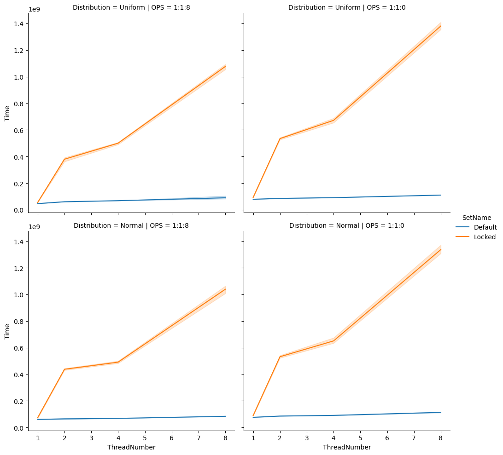
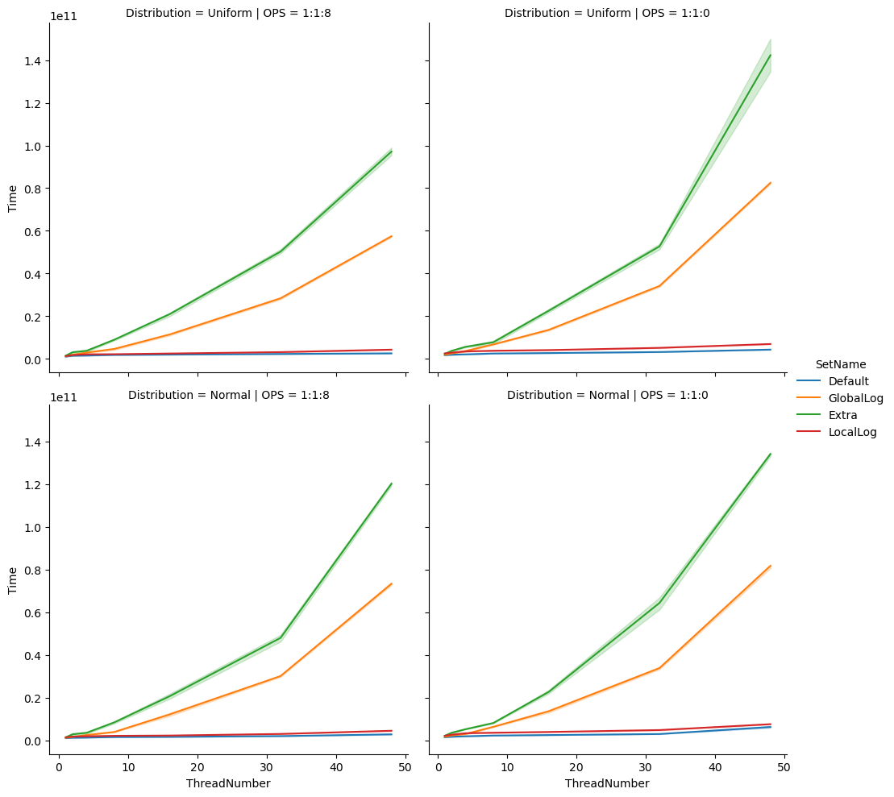
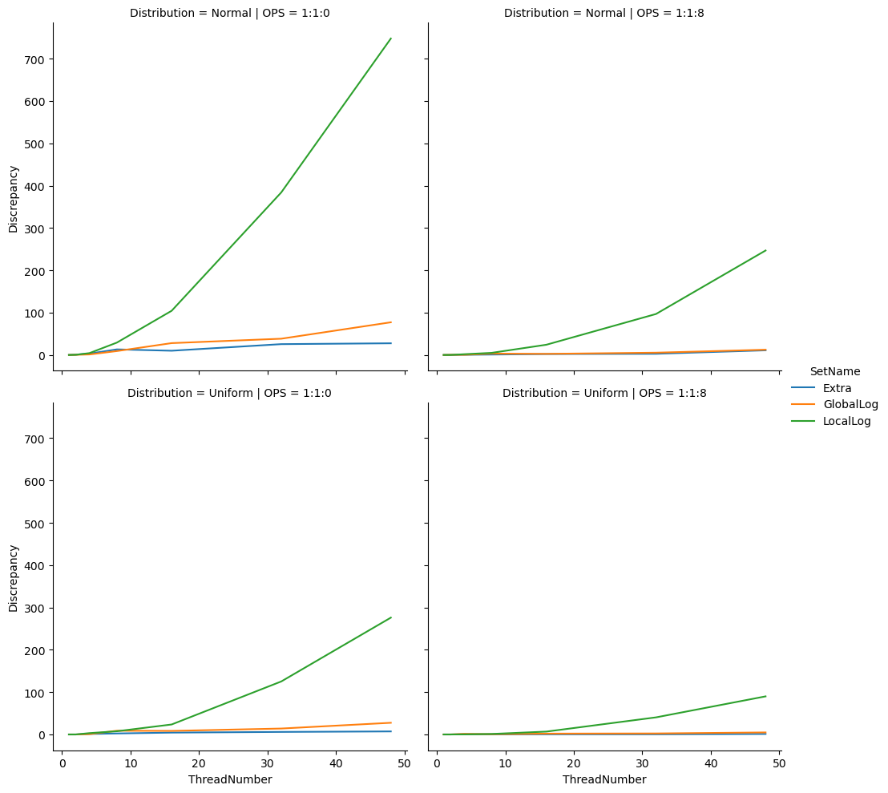

# Lab 3 - Validating Linearizability of Lock-free Skiplists

- Hengyi, Lin

# 1. Measuring execution time

## 1.1 Measurement program

The measurement in Task 1.1 is done by a bash script `scripts/local.sh`, which also measure the locked time sampling in task 2.3.

## 1.2 PDC experiments

The measurement in Task 1.2 is a part of overall Dardel measurement job scripts `scripts/job*.sh`, the idea is to use a quadruple loop to walk over all combination between operation mixure, thread number, distribution, and different implementations.

# 2. Identify and validate linearization points

## 2.1 Identify linearization points

By consulting HSLS, chapter 14, the linearization points (LP) of `LockFreeSkipList` can be described as follows:

1. `add`: when unsuccessfully `add`, the LP is inside the `find` method at the last time `curr` being set, and the `find` call returns a false. When successfully `add`, the LP is at the point where the bottom-level link's CAS operation finished successfully.
2. `remove`: when unsuccessfully `remove`, it's very similar to the `add` case, the LP is inside the `find` method where the last time `curr` being updated and returned a false. Another case for unsuccessfully removing is, when `iMarkedIt` is false, but `marked[0]` is true, at this case, the node was removed by another thread during this removal. Therefore, to return a false, the LP should be right after the previous successful `remove` call's LP. The successful case of `remove` is linearizable at the bottom-level link's CAS operation, i.e., the successful case when `iMarkedIt` is set to true.
3. `contains`: no matter whether the `contains` returns true or false, the last time it updates the `curr` reference at bottom level is the LP of `contains`.

Overall idea to find a linearization point is, in successful returning case, we can find a success `compareAndSet` call to change bottom-level link. This is because the `LockFreeSkipList` use the bottom level as the abstract set, since it can not mutate references in all level at the same time like what `LazySkipList` does. For the unsuccessful returning, we should find the time point when the implementation reads by `get` or `getReference` that leads to a false case.

## 2.2 Develop a validation method

In the `src/Log.java`, the `log` array is firstly sorted according to the timestamp in every `Log.Entry`, then iterate through log array, replay the method call on a `HashSet` instance, and comparing the returned result from `HashSet` with the return value in `Log.Entry`. If there is a difference between them, increment `discrepancy`. After finished iterating all logs, return the final `discrepancy` value.

## 2.3. Locked time sampling

The implementation is a part of `LockFreeSkipList`, since the locked approach is instrusive. A method `needLockingAtLP` is added as a guard condition to the global lock, any subclass can disable locking by override this method to return a false.

Since it's not mentioned in the requirement how the log should be aggregated in task 2.3, I decided to use the same global log implementation, which use `java.util.concurrent.ConcurrentLinkedQueue` as the global logger implementation. 

The execution time figure of local measurement in task 1.1, and this task is shown as belows.

As expect, the locked version has a dramastic performance drop comparing to the default implementation.

We can also find the fact that when using a mixture ratio of 1:1:8 performs better than the 1:1:0, this indicates the `LockFreeSkipList` performs better under the read-heavy workload.

## 2.4/2.5. Lock-free time sampling with local/global log

Source code: `src/SkipListLocalLog.java` and `src/SkipListGlobalLog.java`.

In order to implement the logging ability with different utility classes, I add a method `putLog` in `LockFreeSkipList`, and provide a dummy implementation. In the subclasses, the implementation of `putLog` can be overrided easily.

For the `LocalLog`, a `ConcurrentLinkedMap` is used as the overall main registry of every thread's local log list, and use a `ThreadLocal` as a reference cache to avoid access global registry every time `putLog` is invoked. In `getLog`, the thread local's value will be gathered into one `ArrayList` and returns.

For the `GlobalLog`, a `ConcurrentLinkedQueue` is used, since it use the same implementation of the locked one, the only difference of this class is the `needLockingAtLP` overrided with false.

## 2.7. Extra task: global log from scratch

Source code: `src/LockFreeQueue.java` and `src/SkipListExtra.java`.

The implementation of `LockFreeQueue` comes from HSLS, chapter 10, page 237 to 238. It's used as the `java.util.concurrent.ConcurrentLinkedQueue`'s drop in replacement, the implementation is basically the same to the `GlobalLog` one.

## 3. The figures and conclusion

The execution time figure measured on the Dardel is shown as below.

The same conclusion in task 2.3 still holds true, the `LockFreeSkipList` is more suitable for the heavy-read situation rather than a frequently modifying one. The order of the performance of three different approach is: `LocalLog` > `GlobalLog` > `Extra`. 

On the contrary, for the discrepancy shown in the aboving figure, the `Extra` have the least discrepancy count, then `GlobalLog`, the last one is `LocalLog`, which created a significant number of discrepancies.